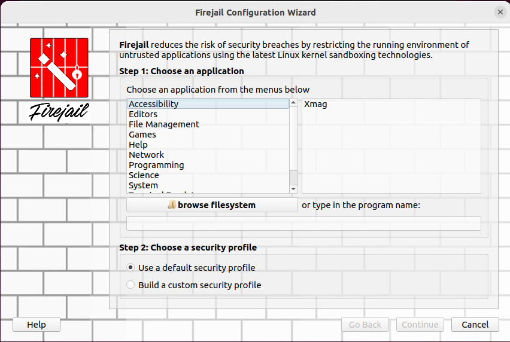
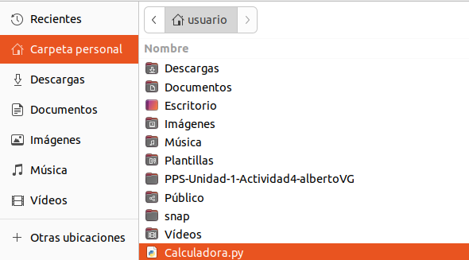

# PPS-Unidad-1-Actividad-4-albertoVG

La actividad consiste en probar la aplicación de la calculadora, que has realizado en una actividad anterior, en un entorno controlado. (Si no la tienes terminada, puedes usar la que tienes adjunta en la tarea)

1. Busca cuáles son las distintas alternativas que tienes para probar esta aplicación en una Sandbox.

Para empezar voy a utilizar Virtual Box para abrir una maquina de ubuntu, y seguramente utilice alguna de las aplicaciones que pongo a continuación.

1. Firejail (Aislamiento Ligero y Rápido)
Firejail es una herramienta de sandboxing que permite ejecutar aplicaciones con permisos restringidos.

2. Docker (Virtualización Ligera)

3. QEMU o VirtualBox (Máquina Virtual Completa)
Si quieres aislamiento total, puedes usar una máquina virtual con QEMU o VirtualBox para ejecutar la calculadora en un sistema Linux independiente.

4. Bubblewrap (Sandbox de Bajo Nivel)
Bubblewrap es otra opción para ejecutar procesos con permisos restringidos.

   
Crea el entorno controlado y prueba la aplicación en él.
Documenta cómo has desarrollado el proyecto en github.

