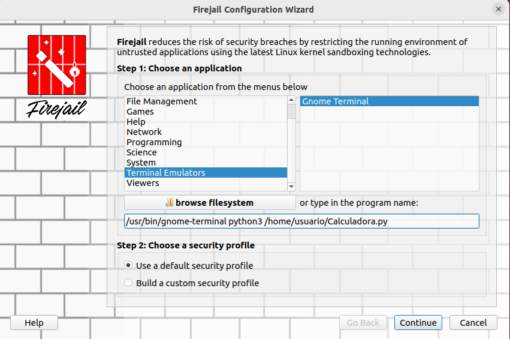

# PPS-Unidad-1-Actividad-4-albertoVG

La actividad consiste en probar la aplicación de la calculadora, que has realizado en una actividad anterior, en un entorno controlado. (Si no la tienes terminada, puedes usar la que tienes adjunta en la tarea)

1. Busca cuáles son las distintas alternativas que tienes para probar esta aplicación en una Sandbox.

Para empezar voy a utilizar Virtual Box para abrir una maquina de ubuntu, y seguramente utilice alguna de las aplicaciones que pongo a continuación.

1.1. Firejail (Aislamiento Ligero y Rápido)
Firejail es una herramienta de sandboxing que permite ejecutar aplicaciones con permisos restringidos.

1.2. Docker (Virtualización Ligera)

1.3. QEMU o VirtualBox (Máquina Virtual Completa)
Si quieres aislamiento total, puedes usar una máquina virtual con QEMU o VirtualBox para ejecutar la calculadora en un sistema Linux independiente.

1.4. Bubblewrap (Sandbox de Bajo Nivel)
Bubblewrap es otra opción para ejecutar procesos con permisos restringidos.

2. Crea el entorno controlado y prueba la aplicación en él.

Voy a utilizar firejail en ubuntu, entonces lo que tenemos que hacer es instalarlo con sudo apt install firejail.

Ahora pulsando en browse filesystem y tenemos que buscar nuestra calculadora

Como nos da error tenemos que instalar el terminal konsole

Despues de instalarlo tenemos que abrir firejail y poner la ruta de konsole y vemos si nos funciona

Como podemos ver a continuación funciona y nos abre el terminal de konsole y nos pone la entrada en el firetools.

Desde el terminal que hemos abierto anteriormente lanzamos la aplicación de la calculadora y vemos que funciona bien la aplicacion de la calculadora.

3. Documenta cómo has desarrollado el proyecto en github.

Dentro de filetools dando al PID podemos ver las especificaciones de la consola

Desde File Manager podemos ver los directorios y ficheros que esta modificando el programa que le hemos pasado al firejail.

En process Tree vemos los procesos que ha lanzado el programa de konsole

En network podemos ver las especificaciones de la red en la que está

Si damos a home nos vuelve a la lista de sandbox

Si estuvieramos en un programa online al pulsar en firejail DNS nos tendria que dar el dominio de donde estamos

